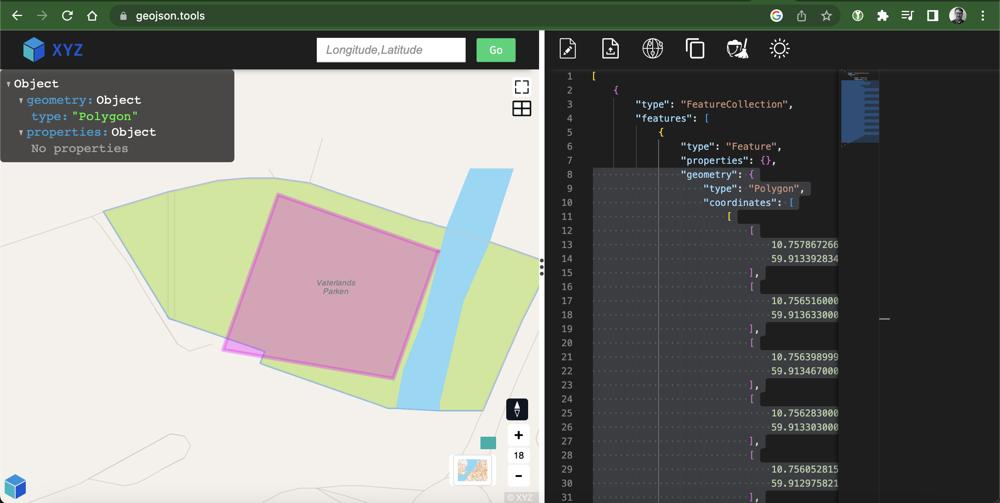
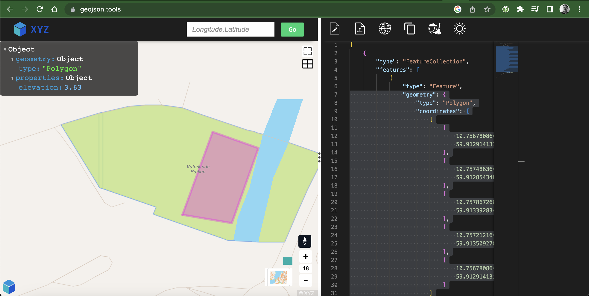
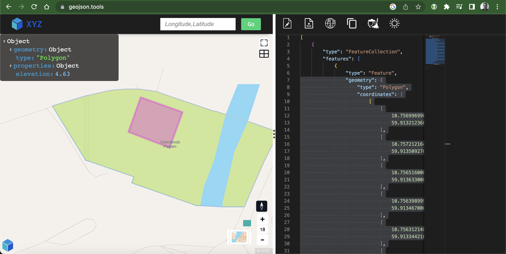
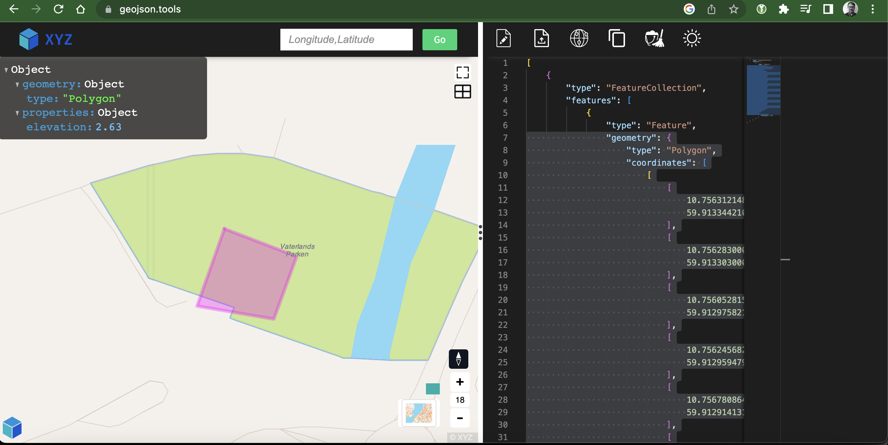

# Polygon backend solution

A serverless app created with SST.

## Task
Your task is to implement a programmatic API with a clean interface that consumes building
limits and height plateaus, splits up the building limits according to the height plateaus, and
stores these three entities (building limits, height plateaus and split building limits) in a
persistent way.
##### Solution:
Programmatic API with a clean interface = rest api.
Stores these three entities in a persistent way = postgis with two tables, projects and polygons.

### Requirements

#### Validation
Although the height plateaus should completely cover the building limits, inaccuracies in the
input may occur. Consider how you can validate the input/output and handle any
inaccuracies such as gaps/holes between height plateaus, etc.
##### Solution:
Validation of request body with jsonschema validation library and also a planned valiation of the geojson after having passed initial validation. The second validation could validate the geojson with sql statements to postgis.

#### Error handling
The API should give meaningful error messages when errors occur.
##### Solution:
As far as it is possible, the lambda handlers try to give as meaningful error messages as possible.

#### Concurrency
Imagine that two users, Bob, and Mary, make modifications to the same project. Bob makes
some modifications to the building limits while Mary changes the height plateaus. What
happens if they call the API at the same time? Make sure the API deals with concurrent
updates.
##### Solution: 
In the update endpoint use a transaction with serializable isolation level for updating the project.

#### Testing
Think about ways of testing your application to make sure it works as intended.
##### Solution: 
unit tests and integration tests with database service in github actions (see .github/workflows/node.js.yml)

#### Deployment
The API should be deployed to an optional cloud service provider.
##### Solution: 
Deployed easily to AWS, see instructions below. AWS credentials must be available in environment variables or in ~/.aws/credentials file. Then run `npm run deploy ExampleStack`

## Visualization of the polygons









## Getting Started

[**Read the tutorial**](https://sst.dev/examples/how-to-use-postgresql-in-your-serverless-app.html)

Install the example.

```bash
$ npx create-sst@latest --template=examples/rest-api-postgresql
# Or with Yarn
$ yarn create sst --template=examples/rest-api-postgresql
```

## Commands

### `npm run start`

Starts the Live Lambda Development environment.

### `npm run build`

Build your app and synthesize your stacks.

### `npm run deploy [stack]`

Deploy all your stacks to AWS. Or optionally deploy, a specific stack.

### `npm run remove [stack]`

Remove all your stacks and all of their resources from AWS. Or optionally removes, a specific stack.

### `npm run test`

Runs your tests using Jest. Takes all the [Jest CLI options](https://jestjs.io/docs/en/cli).

## Documentation

Learn more about the SST.

- [Docs](https://docs.sst.dev/)
- [@serverless-stack/cli](https://docs.sst.dev/packages/cli)
- [@serverless-stack/resources](https://docs.sst.dev/packages/resources)
